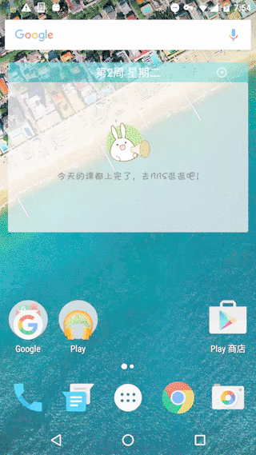

中文 | [English][2]
# App Hider

App Hider项目是基于Evil Hide开发的项目（原作者项目已经不再维护了）

用来隐藏任何你想要的Android应用！



### 注意：
在Nexus 4、Nexus 5X上测试通过
**本项目已支持MIUI13！**

### 特点：
- 可以隐藏软件自身的图标，并通过在拨号盘输入暗号启动应用
- 不需要root！（仅限`原生Android 5.0`以上，一般而言，Nexus家族是可以使用的，包括但不限于Nexus 4、Nexus 5、Nexus 5x、Nexus 6P等，第三方厂商自己修改过的ROM不可使用，包括但不限于三星，小米，华为等）

### 原理
在Android 5.0以下使用以下命令显示和隐藏（需要root权限）：
```
adb shell pm endable <package_name>
adb shell pm disable <package_name>
```
在Android 5.0及以上使用以下命令显示和隐藏（不需要root，但是需要系统权限）:
```
adb shell pm hide <package_name>
adb shell pm unhide <packag_name>
```

区别：
`hide`命令相当于`uninstall -k`卸载应用但是保留数据

实际上，`hide`命令最终调用了以下函数（来自`android.content.pm.PackageManager`）. 不幸的是, 它被标识为`@hide`, 所以在Android SDK中，你无法通过正常手段调用它.
```
/**
 * Puts the package in a hidden state, which is almost like an uninstalled state,
 * making the package unavailable, but it doesn't remove the data or the actual
 * package file. Application can be unhidden by either resetting the hidden state
 * or by installing it, such as with {@link #installExistingPackage(String)}
 * @hide
 */
public abstract boolean setApplicationHiddenSettingAsUser(String packageName, boolean hidden,
        UserHandle userHandle);
```


### 用法：
如果你想使用非root版本，请确保满足条件并切换到`noroot`分支
```
git checkout noroot
```

本软件的默认启动密码是`#1234`
启动方式：
打开拨号盘，输入`#1234`，再拨出，就可以启动本应用了，然后在应用列表里选择应用是否隐藏即可

### 待做列表：
- [x] Android 6.0的权限管理
- [x] 当检测到手机是Android 4.4以上时，使用`pm hide`代替`pm disable`
- [ ] 使用Shizuku提供的接口重写程序
- [ ] 修改暗号启动逻辑
- [ ] 暗号启动应用
- [ ] 兼容Wear OS系统

[1]: https://github.com/2980077544/AppHider/blob/master/README.md
[2]: https://github.com/2980077544/AppHider/blob/master/README_en.md
